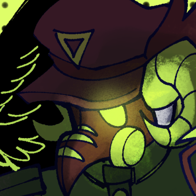

## Disclaimer!
This mod is an add-on for the [PHIGHTING! SWORD DEITIES](https://github.com/BlueDoves3821/phighting-sword-deities) mod, it will not work by itself!

## It's Time To Assist!
This add-on adds the swordium assister factory to the game.

  

And depending on what material you use, it'll produce 8 types of assisters that give 5 minutes of status effects.

  
  
  
  
  
  
  
  

From being a slow-moving tank with the venomshank's tanker.

  

To having 6x movement speed, but have the equalivent of 10 burning status stacked on top of itselves with the firebrand's burnspeed.

  

And finally, to have an extremely short reload speed with windforce's quickshot.

  

You'll be decimating enemies in no time!
